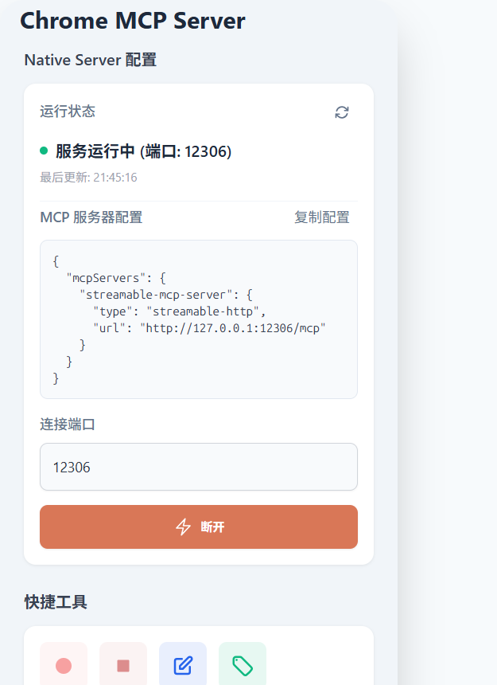

# mcp-chrome-community 🚀

[](https://github.com/y-chell/mcp-chrome-community)
[](https://opensource.org/licenses/MIT)
[](https://www.typescriptlang.org/)
[](https://developer.chrome.com/docs/extensions/)
[](https://github.com/y-chell/mcp-chrome-community/releases)

> 🌟 **Turn your Chrome browser into your intelligent assistant** - Let AI take control of your browser, transforming it into a powerful AI-controlled automation tool.

> Community-maintained fork: https://github.com/y-chell/mcp-chrome-community
>
> Original upstream: https://github.com/hangwin/mcp-chrome
>
> This fork exists because upstream appeared inactive and had gone more than four months without updates when the community fork started moving again. Waiting indefinitely would block fixes and overdue improvements, so this repo continues independently and prioritizes practical improvements.

**📖 Documentation**: [English](README.md) | [中文](README_zh.md)

> This community fork is under active maintenance. Current work focuses on stability fixes, browser compatibility updates, and stronger real-world browser automation capabilities.

---

## 🎯 What is mcp-chrome-community?

mcp-chrome-community is a Chrome extension-based **Model Context Protocol (MCP) server** that exposes your Chrome browser functionality to AI assistants like Claude, enabling complex browser automation, content analysis, and semantic search. Unlike traditional browser automation tools (like Playwright), **mcp-chrome-community** directly uses your daily Chrome browser, leveraging existing user habits, configurations, and login states, allowing various large models or chatbots to take control of your browser and truly become your everyday assistant.

## ✨ Featured Addition

- **A New Visual Editor for Claude Code & Codex**, for more detail here: [VisualEditor](docs/VisualEditor.md)

## ✨ Core Features

- 😁 **Chatbot/Model Agnostic**: Let any LLM or chatbot client or agent you prefer automate your browser
- ⭐️ **Use Your Original Browser**: Seamlessly integrate with your existing browser environment (your configurations, login states, etc.)
- 💻 **Fully Local**: Pure local MCP server ensuring user privacy
- 🚄 **Streamable HTTP**: Streamable HTTP connection method
- 🏎 **Cross-Tab**: Cross-tab context
- 🧠 **Semantic Search**: Built-in vector database for intelligent browser tab content discovery
- 🔍 **Smart Content Analysis**: AI-powered text extraction and similarity matching
- 🌐 **25+ Tools**: Support for screenshots, network monitoring, interactive operations, bookmark management, browsing history, and 25+ other tools
- 🚀 **SIMD-Accelerated AI**: Custom WebAssembly SIMD optimization for 4-8x faster vector operations

## 🆚 Comparison with Similar Projects

| Comparison Dimension    | Playwright-based MCP Server                                                                                               | Chrome Extension-based MCP Server                                                                      |
| ----------------------- | ------------------------------------------------------------------------------------------------------------------------- | ------------------------------------------------------------------------------------------------------ |
| **Resource Usage**      | ❌ Requires launching independent browser process, installing Playwright dependencies, downloading browser binaries, etc. | ✅ No need to launch independent browser process, directly utilizes user's already open Chrome browser |
| **User Session Reuse**  | ❌ Requires re-login                                                                                                      | ✅ Automatically uses existing login state                                                             |
| **Browser Environment** | ❌ Clean environment lacks user settings                                                                                  | ✅ Fully preserves user environment                                                                    |
| **API Access**          | ⚠️ Limited to Playwright API                                                                                              | ✅ Full access to Chrome native APIs                                                                   |
| **Startup Speed**       | ❌ Requires launching browser process                                                                                     | ✅ Only needs to activate extension                                                                    |
| **Response Speed**      | 50-200ms inter-process communication                                                                                      | ✅ Faster                                                                                              |

## 🚀 Quick Start

### Prerequisites

- Node.js 20+ (minimum)
- Node.js 22 or 24 LTS recommended
- CI and release builds currently run on Node.js 24
- Node.js 25 may work, but it is not part of the tested support matrix yet
- Chrome/Chromium browser

### Installation Steps

1. **Download the latest release assets from GitHub**

Download link: https://github.com/y-chell/mcp-chrome-community/releases

You need these two files from the latest release:

- `mcp-chrome-community-extension-<version>.zip`
- `mcp-chrome-community-bridge-v<version>.tgz`

2. **Install the native host from the downloaded `.tgz`**

npm

```bash
npm install -g /path/to/mcp-chrome-community-bridge-v<version>.tgz
```

pnpm

```bash
# pnpm users should run register once after installing from the release package
pnpm add -g /path/to/mcp-chrome-community-bridge-v<version>.tgz
mcp-chrome-community register
```

> This community fork is installed from the GitHub Release `.tgz` asset. `npm install -g mcp-chrome-community-bridge` may install a different package than the one in this repository.

3. **Load Chrome Extension**
   - Extract `mcp-chrome-community-extension-<version>.zip` first
   - Open Chrome and go to `chrome://extensions/`
   - Enable "Developer mode"
   - Click "Load unpacked" and select the extracted extension folder
   - Click the extension icon to open the plugin, then click connect to see the MCP configuration

   Release builds keep a fixed unpacked extension ID for Native Messaging. If you build the extension yourself without `CHROME_EXTENSION_KEY`, Chrome will assign a different ID and the default native host manifest will not match.



If you want to build from source instead of using release assets, see [Contributing Guide](docs/CONTRIBUTING.md).

### Usage with MCP Protocol Clients

#### Using Streamable HTTP Connection (👍🏻 Recommended)

Add the following configuration to your MCP client configuration (using CherryStudio as an example):

> Streamable HTTP connection method is recommended

```json
{
  "mcpServers": {
    "mcp-chrome-community": {
      "type": "streamableHttp",
      "url": "http://127.0.0.1:12306/mcp"
    }
  }
}
```

Default URL is `http://127.0.0.1:12306/mcp`. If you override host or port with `CHROME_MCP_HOST` / `MCP_HTTP_HOST` or `CHROME_MCP_PORT` / `MCP_HTTP_PORT`, update the client URL to match your actual address.

#### Using STDIO Connection (Alternative)

If your client only supports stdio connection method, please use the following approach:

1. First, find your global `node_modules` directory

```sh
# npm
npm root -g
# pnpm
pnpm root -g
```

Then append:

```text
mcp-chrome-community-bridge/dist/mcp/mcp-server-stdio.js
```

Example final path:

```text
/path/to/global/node_modules/mcp-chrome-community-bridge/dist/mcp/mcp-server-stdio.js
```

2. Replace the configuration below with the final path you just obtained

```json
{
  "mcpServers": {
    "mcp-chrome-community-stdio": {
      "command": "node",
      "args": [
        "/path/to/global/node_modules/mcp-chrome-community-bridge/dist/mcp/mcp-server-stdio.js"
      ]
    }
  }
}
```

Example config in Augment:


## 🛠️ Available Tools

Complete tool list: [Complete Tool List](docs/TOOLS.md)

<details>
<summary><strong>📊 Browser Management (6 tools)</strong></summary>

- `get_windows_and_tabs` - List all browser windows and tabs
- `chrome_navigate` - Navigate to URLs and control viewport
- `chrome_switch_tab` - Switch the current active tab
- `chrome_close_tabs` - Close specific tabs or windows
- `chrome_go_back_or_forward` - Browser navigation control
- `chrome_inject_script` - Inject content scripts into web pages
- `chrome_send_command_to_inject_script` - Send commands to injected content scripts
</details>

<details>
<summary><strong>📸 Screenshots & Visual (1 tool)</strong></summary>

- `chrome_screenshot` - Advanced screenshot capture with element targeting, full-page support, and custom dimensions
</details>

<details>
<summary><strong>🌐 Network Monitoring (4 tools)</strong></summary>

- `chrome_network_capture_start/stop` - webRequest API network capture
- `chrome_network_debugger_start/stop` - Debugger API with response bodies
- `chrome_network_request` - Send custom HTTP requests
</details>

<details>
<summary><strong>🔍 Content Analysis (5 tools)</strong></summary>

- `search_tabs_content` - AI-powered semantic search across browser tabs
- `chrome_get_web_content` - Extract HTML/text content from pages
- `chrome_get_interactive_elements` - Find clickable elements
- `chrome_console` - Capture and retrieve console output from browser tabs
- `chrome_collect_debug_evidence` - Bundle screenshot, console/runtime errors, and recent network evidence
</details>

<details>
<summary><strong>🎯 Interaction (3 tools)</strong></summary>

- `chrome_click_element` - Click elements using CSS selectors
- `chrome_fill_or_select` - Fill forms and select options
- `chrome_keyboard` - Simulate keyboard input and shortcuts
</details>

<details>
<summary><strong>📚 Data Management (5 tools)</strong></summary>

- `chrome_history` - Search browser history with time filters
- `chrome_bookmark_search` - Find bookmarks by keywords
- `chrome_bookmark_add` - Add new bookmarks with folder support
- `chrome_bookmark_delete` - Delete bookmarks
</details>

## 🧪 Usage Examples

### AI helps you summarize webpage content and automatically control Excalidraw for drawing

prompt: [excalidraw-prompt](prompt/excalidraw-prompt.md)
Instruction: Help me summarize the current page content, then draw a diagram to aid my understanding.
https://www.youtube.com/watch?v=3fBPdUBWVz0

https://github.com/user-attachments/assets/fd17209b-303d-48db-9e5e-3717141df183

### After analyzing the content of the image, the LLM automatically controls Excalidraw to replicate the image

prompt: [excalidraw-prompt](prompt/excalidraw-prompt.md)|[content-analize](prompt/content-analize.md)
Instruction: First, analyze the content of the image, and then replicate the image by combining the analysis with the content of the image.
https://www.youtube.com/watch?v=tEPdHZBzbZk

https://github.com/user-attachments/assets/60d12b1a-9b74-40f4-994c-95e8fa1fc8d3

### AI automatically injects scripts and modifies webpage styles

prompt: [modify-web-prompt](prompt/modify-web.md)
Instruction: Help me modify the current page's style and remove advertisements.
https://youtu.be/twI6apRKHsk

https://github.com/user-attachments/assets/69cb561c-2e1e-4665-9411-4a3185f9643e

### AI automatically captures network requests for you

query: I want to know what the search API for Xiaohongshu is and what the response structure looks like

https://youtu.be/1hHKr7XKqnQ

https://github.com/user-attachments/assets/dc7e5cab-b9af-4b9a-97ce-18e4837318d9

### AI helps analyze your browsing history

query: Analyze my browsing history from the past month

https://youtu.be/jf2UZfrR2Vk

https://github.com/user-attachments/assets/31b2e064-88c6-4adb-96d7-50748b826eae

### Web page conversation

query: Translate and summarize the current web page
https://youtu.be/FlJKS9UQyC8

https://github.com/user-attachments/assets/aa8ef2a1-2310-47e6-897a-769d85489396

### AI automatically takes screenshots for you (web page screenshots)

query: Take a screenshot of Hugging Face's homepage
https://youtu.be/7ycK6iksWi4

https://github.com/user-attachments/assets/65c6eee2-6366-493d-a3bd-2b27529ff5b3

### AI automatically takes screenshots for you (element screenshots)

query: Capture the icon from Hugging Face's homepage
https://youtu.be/ev8VivANIrk

https://github.com/user-attachments/assets/d0cf9785-c2fe-4729-a3c5-7f2b8b96fe0c

### AI helps manage bookmarks

query: Add the current page to bookmarks and put it in an appropriate folder

https://youtu.be/R_83arKmFTo

https://github.com/user-attachments/assets/15a7d04c-0196-4b40-84c2-bafb5c26dfe0

### Automatically close web pages

query: Close all shadcn-related web pages

https://youtu.be/2wzUT6eNVg4

https://github.com/user-attachments/assets/83de4008-bb7e-494d-9b0f-98325cfea592

## 🤝 Contributing

We welcome contributions! Please see [CONTRIBUTING.md](docs/CONTRIBUTING.md) for detailed guidelines.

## 🚧 Future Roadmap

The next community-fork milestone is not "add as many tools as possible". The priority is to make the existing browser capabilities more reliable, faster, and easier for agents to use correctly.

### 2026-04-25 v1.1 Priorities

- [x] `P0` Stabilize iframe / Shadow DOM / ref-based targeting
  - Fix the class of failures where the element is visibly on the page but the tool still returns `not found`
  - Related issues: `#172`, `#126`
  - Primary modules: `app/chrome-extension/entrypoints/background/tools/browser/read-page.ts`, `interaction.ts`, `computer.ts`, `inject-scripts/accessibility-tree-helper.js`, `click-helper.js`, `fill-helper.js`

- [x] `P0` Add robust waiting and assertions for dynamic pages
  - Cover common agent actions such as "wait until text appears/disappears", "wait until clickable", "wait until request finishes", and "wait until download completes"
  - Related issues: `#93`, `#200`, `#43`
  - Primary modules: `computer.ts`, `common.ts`, `download.ts`, `network-capture.ts`, `app/chrome-extension/entrypoints/background/record-replay/engine/policies/wait.ts`

- [x] `P1` Make screenshots smaller and default to agent-friendly output
  - Reduce token blow-ups, prefer targeted captures, and improve the save/download flow
  - Related issues: `#163`, `#207`
  - Primary modules: `screenshot.ts`, `packages/shared/src/tools.ts`, `app/chrome-extension/utils/image-utils.ts`

- [x] `P1` Improve console / dialog / network result quality
  - Make `chrome_console` more useful for deep objects, handle DevTools conflicts better, and improve dialog/network inspection quality
  - Related issues: `#215`, `#191`, `#201`
  - Primary modules: `console.ts`, `console-buffer.ts`, `dialog.ts`, `javascript.ts`, `network-capture.ts`

- [x] `P1` Tighten multi-session / multi-window / background-run isolation
  - Reduce cross-session interference, focus stealing, and rogue tool behavior under concurrency
  - Current behavior after the hardening pass: each Streamable HTTP / SSE MCP session carries a session context into the extension, tab-scoped tools reuse the session's last known tab/window when the caller omits `tabId` / `windowId`, and same-session or same-tab calls are queued instead of interleaving
  - CDP debugger ownership now counts repeated owners correctly and drops stale state when Chrome detaches the debugger
  - Related issues: `#152`, `#178`, `#162`, `#141`
  - Primary modules: `app/native-server/src/mcp/mcp-server.ts`, `mcp-server-stdio.ts`, `app/chrome-extension/entrypoints/background/native-host.ts`, `computer.ts`, `common.ts`, `app/chrome-extension/utils/cdp-session-manager.ts`

- [x] `P2` Expand high-value page operations
  - Build on top of `chrome_computer`, `chrome_upload_file`, `chrome_handle_download`, and `record_replay_flow_run` to improve `hover`, drag/drop, clipboard actions, tab groups, complex forms, and reusable flows
  - Current behavior after the expansion pass: `chrome_clipboard` supports read/write/paste/copy-selection text operations, `chrome_tab_group` manages Chrome tab groups, `chrome_computer` can drag by selector with interpolated mouse moves, and `fill_form` accepts mixed ref/selector targets with per-field results
  - Related issues: `#141`, `#171`, `#205`
  - Primary modules: `computer.ts`, `file-upload.ts`, `download.ts`, `bookmark.ts`, `history.ts`, `app/chrome-extension/entrypoints/background/tools/record-replay.ts`

### 2026-04-28 Agent UX Hardening Backlog

> Some of the items below already exist at the implementation level, but real-world Claude Code / Codex usage shows they still need more productization and hardening before they feel truly agent-grade.

- [x] `P1` Stabilize `chrome_network_capture` lifecycle and matching behavior
  - We observed cases where `start` succeeds but `stop` reports no active capture, or returns `0 requests captured`; URL pattern handling, session binding, navigation timing, and result delivery still need hardening
  - The priority is an agent-friendly “wait for request / wait for response” experience, not just a low-level capture entry point
  - Current behavior after the hardening pass: exact `https://...` URLs pre-bind capture before navigation, wildcard patterns attach to an existing tab, and `includeStatic=false` still keeps XHR/fetch responses such as `text/html` while filtering top-level document/static responses
  - Suggested subtasks:
    1. Normalize URL pattern rules and document exact URL vs wildcard vs current-tab defaults
    2. Bind capture lifecycle more explicitly to tab / frame / navigation state so `start` cannot silently lose ownership
    3. Return more stable summary fields such as matched requests, ignored requests, and stop reason
    4. Add regression coverage for start → navigate → stop, repeated start/stop, timeout stop, and no-request stop
  - Acceptance direction: on a normal `https` page, `start` → navigate → `stop` should reliably return captured requests instead of sporadic “no active capture” failures
  - Primary modules: `network-capture.ts`, `common.ts`, `app/chrome-extension/utils/cdp-session-manager.ts`

- [x] `P1` Promote waiting / assertions from internal policy to first-class tools
  - Waiting exists in internal strategies and composite flows, but agents still benefit from explicit `wait_for` / `assert` style tools for element visibility, text changes, URL changes, network idle, and similar high-frequency conditions
  - The goal is not “possible via custom JS”, but “cheap and reliable for agents to use correctly”
  - Suggested subtasks:
    1. Define one condition schema covering element, text, URL, title, JS predicate, and network-idle waits
    2. Standardize timeout, polling interval, failure messages, and debugging context
    3. Reuse the same waiting core across `chrome_computer`, record/replay flows, and download handling
    4. Add integration cases for dynamic lists, lazy loading, disabled-to-enabled buttons, and redirects
  - Acceptance direction: common waits such as “element appears”, “text changes”, and “navigation finishes” should no longer require ad-hoc JS or manual retries
  - Primary modules: `computer.ts`, `common.ts`, `app/chrome-extension/entrypoints/background/record-replay/engine/policies/wait.ts`

- [x] `P1` Improve element querying and DOM observability
  - `read_page` already works well for visible-page understanding, but it is still not the most direct fit for bulk element queries, raw DOM/attributes, hidden elements, or local HTML fragments
  - Candidate additions include `query_elements`, `get_element_html`, and `get_dom_snapshot`
  - Suggested subtasks:
    1. Design a batch element-query response that includes ref, selector hint, text, role, attributes, visibility, and enabled state
    2. Add local DOM / outerHTML reads for hidden elements and subtree inspection
    3. Align ref semantics across `read_page` and future DOM-query tools to reduce cross-tool mismatches
    4. Add regression samples for tables, lists, complex forms, and Shadow DOM
  - Acceptance direction: agents should be able to reliably obtain either “a list of matching elements” or “the real DOM fragment for this node”, not just a page summary
  - Primary modules: `read-page.ts`, `inject-scripts/accessibility-tree-helper.js`, `javascript.ts`

- [x] `P1` Close the loop for uploads and downloads
  - Upload and download actions exist, but agents still need stable status confirmation: whether the transfer finished, where the file ended up, and why it failed when it does fail
  - Prioritize download lists, final saved paths, upload progress, and failure reasons
  - Suggested subtasks:
    1. Add download status queries with pending / in_progress / completed / failed, file name, path, size, and mime type
    2. Add upload status queries with target element, start time, completion state, and failure reason
    3. Document compatibility boundaries for browser-native dialogs, OS file pickers, and background downloads
    4. Add coverage for single-file, multi-file, duplicate-name, and canceled upload/download scenarios
  - Acceptance direction: after an upload or download, the agent should know the final status and file destination directly instead of guessing or probing with extra scripts
  - Primary modules: `download.ts`, `file-upload.ts`, `common.ts`

- [x] `P2` Better workflow orchestration for iframes, tabs, and windows
  - The low-level building blocks exist, but complex workflows still need clearer frame enumeration / switching, new-tab waiting, result-tab identification, and cross-window isolation
  - This matters most for payments, sign-in flows, embedded editors, and multi-step redirects
  - Suggested subtasks:
    1. Add frame enumeration / switching with frame hierarchy, URL, title, and interactability hints
    2. Add new-tab waiting, result-tab identification, and context restoration after tab close
    3. Clarify active-tab selection and background-run boundaries under multi-window concurrency
    4. Add integration scenarios for OAuth, payment pages, embedded editors, and redirect-heavy flows
  - Acceptance direction: multi-step flows across iframe / new-tab / new-window boundaries should run without frequently jumping into the wrong context
  - Primary modules: `interaction.ts`, `computer.ts`, `app/native-server/src/mcp/mcp-server.ts`

- [x] `P2` Stronger console / runtime-error / debugging evidence tools
  - Beyond arbitrary JS execution, agents need direct access to console logs, runtime errors, failure snapshots, and packaged debugging context for self-diagnosis
  - Suggested subtasks:
    1. Add recent logs, errors-only, clear-logs, and runtime-exception summaries
    2. Standardize a failure evidence bundle: screenshot, URL, title, recent console, and key-request summary
    3. Improve deep-object serialization, circular-reference handling, DevTools-conflict handling, and truncation behavior
    4. Add debugging samples for frontend exceptions, resource-load failures, and cross-origin issues
  - Acceptance direction: when a page “does nothing”, the agent should be able to collect enough debugging evidence without immediately falling back to custom JS
  - Primary modules: `console.ts`, `console-buffer.ts`, `javascript.ts`, `screenshot.ts`

### Mid-Term Directions

- [ ] Move recording/playback from "works in basic cases" to "stable and reusable"
- [ ] Move workflow automation from "single run" to "publishable, debuggable, schedulable"
- [ ] Extend browser support after Chrome / Edge stability is solid enough
- [ ] Add authentication and tool permission tiers

---

**Want to contribute to any of these features?** Check out our [Contributing Guide](docs/CONTRIBUTING.md) and join our development community!

## 📄 License

This project is licensed under the MIT License - see the [LICENSE](LICENSE) file for details.

## 📚 More Documentation

- [Architecture Design](docs/ARCHITECTURE.md) - Detailed technical architecture documentation
- [TOOLS API](docs/TOOLS.md) - Complete tool API documentation
- [Troubleshooting](docs/TROUBLESHOOTING.md) - Common issue solutions
