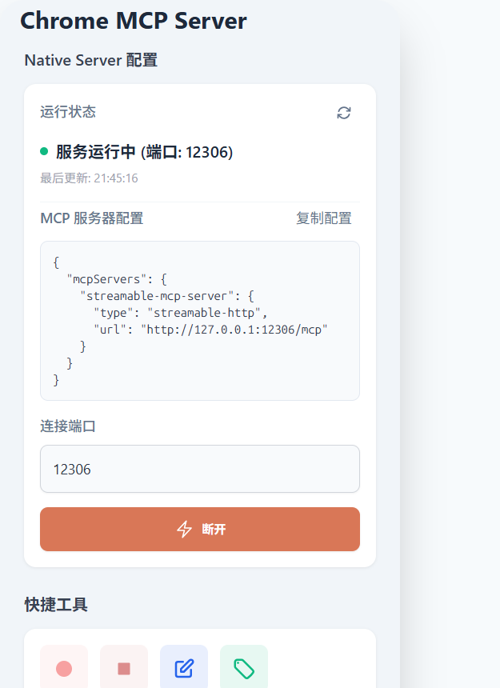

# mcp-chrome-community 🚀

[](https://github.com/y-chell/mcp-chrome-community)
[](https://opensource.org/licenses/MIT)
[](https://www.typescriptlang.org/)
[](https://developer.chrome.com/docs/extensions/)
[](https://github.com/y-chell/mcp-chrome-community/releases)

> 🌟 **Turn your Chrome browser into your intelligent assistant** - Let AI take control of your browser, transforming it into a powerful AI-controlled automation tool.

> Community-maintained fork: https://github.com/y-chell/mcp-chrome-community
>
> Original upstream: https://github.com/hangwin/mcp-chrome
>
> This fork exists because upstream appeared inactive and had gone more than four months without updates when the community fork started moving again. Waiting indefinitely would block fixes and overdue improvements, so this repo continues independently and prioritizes practical improvements.

**📖 Documentation**: [English](README.md) | [中文](README_zh.md)

> This community fork is under active maintenance. Current work focuses on stability fixes, browser compatibility updates, and stronger real-world browser automation capabilities.

---

## 🎯 What is mcp-chrome-community?

mcp-chrome-community is a **Model Context Protocol (MCP) browser server** built from a Chrome extension and a local Native Server. It exposes the current Chrome windows, tabs, login state, and browser capabilities to Codex, Claude Code, and other modern MCP clients. Unlike automation that starts a separate browser process, this project operates the Chrome profile the user is already running.

## ✨ Featured Addition

- **A New Visual Editor for Claude Code & Codex**, for more detail here: [VisualEditor](docs/VisualEditor.md)
- **Real-browser agent toolset**: page reading, element querying, JavaScript execution, CDP-driven input, screenshots, network capture, console evidence, upload/download status checks, and more.
- **More reliable tab/window control**: frame enumeration, new-tab waiting, tab groups, background screenshots, per-client tab reuse, and `chrome_health` version checks.
- **Better Claude Code / Codex ergonomics**: `wait_for` / `assert`, `read_page`, `query_elements`, `computer`, `clipboard`, and record/replay tools reduce ad-hoc JavaScript and repeated guessing.

## ✨ Core Features

- 😁 **Chatbot/Model Agnostic**: Let any LLM or chatbot client or agent you prefer automate your browser
- ⭐️ **Use Your Original Browser**: Seamlessly integrate with your existing browser environment (your configurations, login states, etc.)
- 💻 **Fully Local**: Pure local MCP server ensuring user privacy
- 🚄 **Streamable HTTP**: Streamable HTTP connection method
- 🏎 **Cross-Tab**: Cross-tab context
- 🧠 **Semantic Search**: Built-in vector database for intelligent browser tab content discovery
- 🔍 **Smart Content Analysis**: AI-powered text extraction and similarity matching
- 🌐 **41 Static Tools**: Support for screenshots, network monitoring, interactions, bookmarks, browsing history, waits/assertions, debug evidence, upload/download status, tab groups, and record/replay
- 🚀 **SIMD-Accelerated AI**: Custom WebAssembly SIMD optimization for 4-8x faster vector operations

## ✅ Current Key Capabilities

- Page reading: `chrome_scan_compact`, `chrome_read_page`, `chrome_query_elements`, `chrome_get_element_html`, and `chrome_get_web_content`, with compact scans, refs, `frameId`, `frameUrl`, local DOM reads, visible/hidden elements, and open Shadow DOM queries.
- Page operations: `chrome_click_element`, `chrome_fill_or_select`, `chrome_keyboard`, and `chrome_computer`, with coordinates, selectors, refs, drag, scroll, typing, waits, and screenshot-assisted actions.
- Waits and checks: `chrome_wait_for`, `chrome_assert`, and `chrome_wait_for_tab` cover elements, text, URL, title, JavaScript predicates, network requests, network idle, and downloads.
- Debugging: `chrome_console`, `chrome_collect_debug_evidence`, `chrome_javascript`, `chrome_screenshot`, `chrome_cdp_command`, and `chrome_cdp_batch` expose logs, runtime errors, screenshots, recent network evidence, and raw CDP.
- Network and files: `chrome_network_capture`, `chrome_network_request`, `chrome_upload_file`, `chrome_get_upload_status`, and `chrome_handle_download` cover capture, browser-context requests, upload status, drag/drop upload, and download status.
- Browser data: `chrome_history`, `chrome_bookmark_*`, `chrome_tab_group`, and `chrome_clipboard` cover history, bookmarks, tab groups, and clipboard operations.
- Version and real-browser checks: `chrome_health` reports extension version, bridge version, schema hash, tool count, and current browser state; real-browser tests cover forms, async updates, console, new tabs, clipboard, drag/drop, and tab groups.

## 🔌 Modern MCP Capabilities

- Uses `@modelcontextprotocol/sdk ^1.29.0`, recommends Streamable HTTP, and retains STDIO and legacy SSE compatibility.
- Object tool results expose both legacy `content` and modern `structuredContent`; stable results declare `outputSchema`.
- Tool contracts include strict input schemas and read-only, destructive, idempotent, and related `annotations`.
- Dynamic workflow discovery uses a non-blocking cache and emits `notifications/tools/list_changed` after real catalog changes.
- Cancellation and progress propagate through MCP, Native Messaging, extension queues, and cooperative wait tools.
- STDIO supports `full`, `core`, and `search` catalogs. Compact profiles can still discover, inspect, and proxy-call hidden tools.
- The HTTP layer supports Host/Origin validation, optional bearer authentication, session limits, and idle cleanup. Remote listeners require explicit security configuration.

## 🤖 Built-in Assistant

The extension sidepanel uses locally installed coding agents. It is not a separate chat service with its own API-key form:

- Codex launches the local `codex` CLI and inherits login, provider, and default-model settings from `~/.codex`.
- Claude uses the current Claude Agent SDK and inherits the local Claude Code login or supported environment variables.
- Leaving the model empty delegates to the CLI/SDK default, avoiding stale extension defaults.
- Codex models and reasoning efforts are discovered through `codex debug models`; Claude uses the latest `fable`, `opus`, `sonnet`, and `haiku` aliases.
- Project and session settings accept arbitrary model IDs. Suggestions are not an allowlist.

Each assistant run receives this project's local Streamable HTTP MCP endpoint without rewriting global Codex or Claude Code MCP configuration. Sessions, messages, and attachments remain in the local Native Server data directory.

## 🆚 Comparison with Similar Projects

| Comparison Dimension    | Playwright-based MCP Server                                                                                               | Chrome Extension-based MCP Server                                                                      |
| ----------------------- | ------------------------------------------------------------------------------------------------------------------------- | ------------------------------------------------------------------------------------------------------ |
| **Resource Usage**      | ❌ Requires launching independent browser process, installing Playwright dependencies, downloading browser binaries, etc. | ✅ No need to launch independent browser process, directly utilizes user's already open Chrome browser |
| **User Session Reuse**  | ❌ Requires re-login                                                                                                      | ✅ Automatically uses existing login state                                                             |
| **Browser Environment** | ❌ Clean environment lacks user settings                                                                                  | ✅ Fully preserves user environment                                                                    |
| **API Access**          | ⚠️ Limited to Playwright API                                                                                              | ✅ Full access to Chrome native APIs                                                                   |
| **Startup Speed**       | ❌ Requires launching browser process                                                                                     | ✅ Only needs to activate extension                                                                    |
| **Response Speed**      | 50-200ms inter-process communication                                                                                      | ✅ Faster                                                                                              |

## 🚀 Quick Start

### Prerequisites

- Node.js 20+ (minimum)
- Node.js 22 or 24 LTS recommended
- CI and release builds currently run on Node.js 24
- Node.js 25 may work, but it is not part of the tested support matrix yet
- Chrome/Chromium browser
- The built-in assistant additionally requires a logged-in local `codex` or Claude Code installation; external MCP clients do not

### Installation Steps

1. **Download the latest release assets from GitHub**

Download link: https://github.com/y-chell/mcp-chrome-community/releases

You need these two files from the latest release:

- `mcp-chrome-community-extension-<version>.zip`
- `mcp-chrome-community-bridge-v<version>.tgz`

2. **Install the native host from the downloaded `.tgz`**

npm

```bash
npm install -g /path/to/mcp-chrome-community-bridge-v<version>.tgz
```

pnpm

```bash
# pnpm users should run register once after installing from the release package
pnpm add -g /path/to/mcp-chrome-community-bridge-v<version>.tgz
mcp-chrome-community register
```

> This community fork is installed from the GitHub Release `.tgz` asset. `npm install -g mcp-chrome-community-bridge` may install a different package than the one in this repository.

3. **Load Chrome Extension**
   - Extract `mcp-chrome-community-extension-<version>.zip` first
   - Open Chrome and go to `chrome://extensions/`
   - Enable "Developer mode"
   - Click "Load unpacked" and select the extracted extension folder
   - Click the extension icon to open the plugin, then click connect to see the MCP configuration

   Release builds keep a fixed unpacked extension ID for Native Messaging. If you build the extension yourself without `CHROME_EXTENSION_KEY`, Chrome will assign a different ID and the default native host manifest will not match.



If you want to build from source instead of using release assets, see [Contributing Guide](docs/CONTRIBUTING.md).

### Usage with MCP Protocol Clients

#### Using Streamable HTTP Connection (👍🏻 Recommended)

Add the following configuration to your MCP client configuration (using CherryStudio as an example):

> Streamable HTTP connection method is recommended

```json
{
  "mcpServers": {
    "mcp-chrome-community": {
      "type": "streamableHttp",
      "url": "http://127.0.0.1:12306/mcp"
    }
  }
}
```

Default URL is `http://127.0.0.1:12306/mcp`. The server listens on loopback only and keeps bearer
authentication optional for existing local configurations. `CHROME_MCP_BIND_HOST` controls the
actual listen address, while `CHROME_MCP_HOST` / `MCP_HTTP_HOST` controls the address used by
internal clients. Any non-loopback listener requires `CHROME_MCP_AUTH_TOKEN`; wildcard listeners
also require `CHROME_MCP_ALLOWED_HOSTS`. Only MCP transport routes accept remote clients; Agent and
extension HTTP routes remain local-only. See [CLI MCP Configuration](docs/mcp-cli-config.md) for
Codex, Claude Code, authentication, and session-limit examples.

#### Using STDIO Connection (Alternative)

If your client only supports stdio connection method, please use the following approach:

1. First, find your global `node_modules` directory

```sh
# npm
npm root -g
# pnpm
pnpm root -g
```

Then append:

```text
mcp-chrome-community-bridge/dist/mcp/mcp-server-stdio.js
```

Example final path:

```text
/path/to/global/node_modules/mcp-chrome-community-bridge/dist/mcp/mcp-server-stdio.js
```

2. Replace the configuration below with the final path you just obtained

```json
{
  "mcpServers": {
    "mcp-chrome-community-stdio": {
      "command": "node",
      "args": [
        "/path/to/global/node_modules/mcp-chrome-community-bridge/dist/mcp/mcp-server-stdio.js"
      ],
      "env": {
        "CHROME_MCP_TOOL_PROFILE": "core"
      }
    }
  }
}
```

STDIO supports `CHROME_MCP_TOOL_PROFILE` to control how many tools are advertised to the client:

- `full`: advertises the original 41 tools. This is the backward-compatible default.
- `core`: advertises 12 common browser tools plus 3 catalog tools. Recommended for routine Codex and Claude Code browsing.
- `search`: advertises health, tab listing, and 3 catalog tools. Recommended when the client connects to several MCP servers.

The `core` and `search` profiles expose `chrome_search_tools`, `chrome_describe_tool`, and `chrome_call_tool`. Hidden tools remain available through catalog search and proxy calls without restarting the server or changing profiles.

Example config in Augment:


## 🛠️ Available Tools

Complete tool list: [Complete Tool List](docs/TOOLS.md)

<details>
<summary><strong>📊 Browser and Tabs</strong></summary>

- `get_windows_and_tabs` - List all browser windows and tabs
- `chrome_health` - Show extension, bridge, tool count, and current browser status
- `chrome_list_frames` - List iframes in the current tab
- `chrome_wait_for_tab` - Wait for a new tab or an existing matching tab
- `chrome_navigate` - Open URLs, refresh, go back/forward, or create a new window
- `chrome_switch_tab` - Switch the current active tab
- `chrome_close_tabs` - Close tabs
- `chrome_tab_group` - Create, name, collapse, move, or ungroup Chrome tab groups
</details>

<details>
<summary><strong>🔍 Page Reading and Locating</strong></summary>

- `chrome_read_page` - Read visible page content and interactive elements
- `chrome_scan_compact` - Low-output page scan with titles, forms, buttons, inputs, dialogs, iframes, and important text blocks
- `chrome_query_elements` - Query elements with CSS/XPath, including hidden elements and frames
- `chrome_get_element_html` - Get HTML for a specific element
- `chrome_get_web_content` - Extract page text or HTML
- `chrome_get_interactive_elements` - Get interactive page elements
- `search_tabs_content` - Semantic search across opened tabs
</details>

<details>
<summary><strong>🎯 Page Operations</strong></summary>

- `chrome_click_element` - Click elements by selector, XPath, ref, or coordinates
- `chrome_fill_or_select` - Fill inputs, textarea, select, checkbox, and radio controls
- `chrome_keyboard` - Send keyboard input and shortcuts
- `chrome_computer` - Combined mouse, keyboard, scroll, drag, and screenshot operations
- `chrome_clipboard` - Read/write clipboard, paste text, and copy selected text
- `chrome_request_element_selection` - Ask the user to pick an element when automation cannot locate it reliably
</details>

<details>
<summary><strong>⏱️ Waits and Assertions</strong></summary>

- `chrome_wait_for` - Wait for elements, text, URL, title, JS predicates, network requests, network idle, or downloads
- `chrome_assert` - Assert the same conditions with a clear failure response
</details>

<details>
<summary><strong>📸 Screenshots, Recording, and Performance</strong></summary>

- `chrome_screenshot` - Screenshot capture with full-page, element, base64, and file output support
- `chrome_gif_recorder` - Record tab operations and export a GIF
- `performance_start_trace` - Start a performance trace
- `performance_stop_trace` - Stop a performance trace
- `performance_analyze_insight` - Return lightweight trace analysis
</details>

<details>
<summary><strong>🌐 Network, Files, and Dialogs</strong></summary>

- `chrome_network_capture` - Capture requests, optionally with response bodies
- `chrome_network_request` - Send HTTP requests with browser context
- `chrome_upload_file` - Upload local, URL, or base64 files to page file inputs
- `chrome_get_upload_status` - Query upload selection status
- `chrome_handle_download` - Wait, query, or list downloads
- `chrome_handle_dialog` - Handle alert, confirm, and prompt dialogs
</details>

<details>
<summary><strong>🧰 Debugging and Scripts</strong></summary>

- `chrome_javascript` - Execute JavaScript in a page and return JSON-compatible results
- `chrome_cdp_command` - Send one raw Chrome DevTools Protocol command
- `chrome_cdp_batch` - Send multiple CDP commands in one call
- `chrome_console` - Read console logs and runtime exceptions
- `chrome_collect_debug_evidence` - Collect page content, screenshot, console, exceptions, and recent network evidence
</details>

<details>
<summary><strong>📚 Browser Data</strong></summary>

- `chrome_history` - Search browsing history with time filters
- `chrome_bookmark_search` - Search bookmarks by keywords
- `chrome_bookmark_add` - Add bookmarks with folder support
- `chrome_bookmark_delete` - Delete bookmarks
</details>

## 🧪 Usage Examples

### AI helps you summarize webpage content and automatically control Excalidraw for drawing

prompt: [excalidraw-prompt](prompt/excalidraw-prompt.md)
Instruction: Help me summarize the current page content, then draw a diagram to aid my understanding.
https://www.youtube.com/watch?v=3fBPdUBWVz0

https://github.com/user-attachments/assets/fd17209b-303d-48db-9e5e-3717141df183

### After analyzing the content of the image, the LLM automatically controls Excalidraw to replicate the image

prompt: [excalidraw-prompt](prompt/excalidraw-prompt.md)|[content-analize](prompt/content-analize.md)
Instruction: First, analyze the content of the image, and then replicate the image by combining the analysis with the content of the image.
https://www.youtube.com/watch?v=tEPdHZBzbZk

https://github.com/user-attachments/assets/60d12b1a-9b74-40f4-994c-95e8fa1fc8d3

### AI automatically injects scripts and modifies webpage styles

prompt: [modify-web-prompt](prompt/modify-web.md)
Instruction: Help me modify the current page's style and remove advertisements.
https://youtu.be/twI6apRKHsk

https://github.com/user-attachments/assets/69cb561c-2e1e-4665-9411-4a3185f9643e

### AI automatically captures network requests for you

query: I want to know what the search API for Xiaohongshu is and what the response structure looks like

https://youtu.be/1hHKr7XKqnQ

https://github.com/user-attachments/assets/dc7e5cab-b9af-4b9a-97ce-18e4837318d9

### AI helps analyze your browsing history

query: Analyze my browsing history from the past month

https://youtu.be/jf2UZfrR2Vk

https://github.com/user-attachments/assets/31b2e064-88c6-4adb-96d7-50748b826eae

### Web page conversation

query: Translate and summarize the current web page
https://youtu.be/FlJKS9UQyC8

https://github.com/user-attachments/assets/aa8ef2a1-2310-47e6-897a-769d85489396

### AI automatically takes screenshots for you (web page screenshots)

query: Take a screenshot of Hugging Face's homepage
https://youtu.be/7ycK6iksWi4

https://github.com/user-attachments/assets/65c6eee2-6366-493d-a3bd-2b27529ff5b3

### AI automatically takes screenshots for you (element screenshots)

query: Capture the icon from Hugging Face's homepage
https://youtu.be/ev8VivANIrk

https://github.com/user-attachments/assets/d0cf9785-c2fe-4729-a3c5-7f2b8b96fe0c

### AI helps manage bookmarks

query: Add the current page to bookmarks and put it in an appropriate folder

https://youtu.be/R_83arKmFTo

https://github.com/user-attachments/assets/15a7d04c-0196-4b40-84c2-bafb5c26dfe0

### Automatically close web pages

query: Close all shadcn-related web pages

https://youtu.be/2wzUT6eNVg4

https://github.com/user-attachments/assets/83de4008-bb7e-494d-9b0f-98325cfea592

## 🤝 Contributing

We welcome contributions! Please see [CONTRIBUTING.md](docs/CONTRIBUTING.md) for detailed guidelines.

## 🚧 Future Roadmap

GenericAgent-inspired browser automation pieces have already been folded in: compact page scanning, raw CDP commands, CDP batches, frame-aware DOM queries, background CDP screenshots, complex upload handling, and clearer tool descriptions.

Remaining work:

- Continue `chrome_javascript` with CDP execution-context support to reduce manual CDP calls for cross-origin iframe cases.
- Export canvas/img content directly as base64 to reduce screenshot-cropping mistakes.
- Move record/replay from "works" to stable and reusable.
- Move automated tasks from one-off runs to publishable, debuggable, schedulable tasks.
- Keep Chrome / Edge stable first, then evaluate Firefox.
- Continue refining permission tiers and audit metadata for high-risk browser tools.

### Windows desktop-level control, later

This can borrow ideas from GA's `ljqCtrl`, but it should be a separate desktop tool group instead of being mixed into browser tools.

- Candidate tools: `desktop_screenshot`, `desktop_click`, `desktop_move`, `desktop_key`, `desktop_type`, `desktop_window_list`, `desktop_activate_window`, `desktop_find_image`.
- On Windows, prefer `win32api`, `win32gui`, `win32con`, `mss`, and `Pillow`; use `pyautogui` only when needed.
- Coordinates must clearly state physical pixels and DPI scaling to avoid shifted clicks.
- Use it only for file pickers, OS dialogs, non-browser apps, Chrome permission popups, and UI that extension APIs cannot operate.

---

**Want to contribute to any of these features?** Check out our [Contributing Guide](docs/CONTRIBUTING.md) and join our development community!

## 📄 License

This project is licensed under the MIT License - see the [LICENSE](LICENSE) file for details.

## 📚 More Documentation

- [Architecture Design](docs/ARCHITECTURE.md) - Detailed technical architecture documentation
- [TOOLS API](docs/TOOLS.md) - Complete tool API documentation
- [Troubleshooting](docs/TROUBLESHOOTING.md) - Common issue solutions
- [MCP Configuration](docs/mcp-cli-config.md) - Codex, Claude Code, authentication, and session settings
