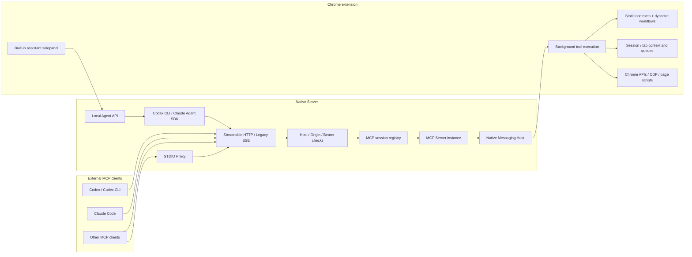

# mcp-chrome-community Architecture

This document describes the current community-fork runtime. The protocol layer targets `@modelcontextprotocol/sdk` v1.29 while retaining compatibility with clients that only consume text tool results.

## System Boundaries

The project has four runtime boundaries:

1. MCP clients such as Codex, Claude Code, desktop clients, and other agents.
2. The Native Server, which owns MCP transports, sessions, security checks, the local Agent API, and Native Messaging.
3. The Chrome extension, which executes browser tools and maintains dynamic workflow and browser-session state.
4. The user's current Chrome profile, including existing windows, tabs, sessions, and browser configuration.

## MCP Protocol Layer

### Transports

- Recommended endpoint: `POST /mcp` over Streamable HTTP.
- Compatibility endpoints: `GET /sse` and `/messages` for legacy SSE clients.
- STDIO: `mcp-server-stdio.js` proxies to the same HTTP MCP service instead of duplicating browser tool logic.
- Each HTTP/SSE session owns a separate MCP Server and transport, so clients do not share connection state.

### Tool Contracts

`packages/shared/src/tools.ts` is the main source of truth for the 41 static tools. It owns:

- `name`, `description`, and strict input schemas
- read-only, destructive, idempotent, and open-world `annotations`
- English and Chinese search terms and aliases
- `outputSchema` for tools with stable result objects

The Native Server, extension execution layer, STDIO profiles, and tests consume this contract to reduce drift.

### Result Compatibility

Stable object results expose both:

- `content`: text or image content for older clients.
- `structuredContent`: object data for modern MCP clients.

Only tools with verified stable output declare `outputSchema`. Images, dynamic flows, and shape-variable results continue to use MCP `content` as their primary representation.

### Discovery

- The `full` profile advertises all 41 static tools.
- The `core` and `search` profiles advertise common tools plus `chrome_search_tools`, `chrome_describe_tool`, and `chrome_call_tool`.
- Dynamic workflow discovery uses a non-blocking cache owned by each MCP Server instance.
- Real catalog changes trigger `notifications/tools/list_changed`.
- A refresh failure preserves the last successful catalog.

### Cancellation and Progress

The MCP request `AbortSignal` propagates through the Native Server, Native Messaging, extension isolation queues, and cooperative waits. Download, network, and general waits emit throttled monotonic progress and clean up listeners, timers, and temporary capture state when cancelled.

## Native Server

`app/native-server/` has three responsibilities:

- MCP transport and session lifecycle.
- Native Messaging request routing to the Chrome extension.
- Local-only `/agent/*` APIs, SQLite sessions, and attachment storage for the built-in assistant.

Important modules:

- `src/server/index.ts`: Fastify, MCP routes, transport creation, and lifecycle.
- `src/server/mcp-session-registry.ts`: capacity, idle expiry, and transport cleanup.
- `src/server/mcp-http-security.ts`: Host, Origin, bearer token, and remote-route boundaries.
- `src/mcp/register-tools.ts`: tool registration, dynamic catalogs, call context, and result adaptation.
- `src/native-messaging-host.ts`: extension connection, request correlation, cancellation, and progress.
- `src/agent/`: the built-in assistant, SQLite state, and Codex/Claude engines.

## Chrome Extension

`app/chrome-extension/` is the browser execution boundary:

- Background executors call Chrome APIs, CDP, and content scripts.
- Browser session context isolates the last tab/window by MCP session/client and queues operations for the same session or tab.
- Content scripts implement DOM access, page interaction, the visual editor, and page-side events.
- The popup shows connection state, MCP configuration, and local semantic-model cache state.
- The sidepanel hosts the built-in assistant UI.

Local semantic search uses Transformers.js, Web Workers, IndexedDB, and WASM SIMD. It is separate from Codex and Claude model execution.

## Built-in Assistant

The assistant does not maintain a separate third-party API-key store:

- The Codex engine launches the local `codex` CLI and inherits its login, provider, and default model from `~/.codex`.
- The Claude engine uses `@anthropic-ai/claude-agent-sdk` and inherits the local Claude Code login or supported environment variables.
- An empty model setting delegates selection to the local CLI/SDK default.
- Codex models are discovered at runtime through `codex debug models`; Claude uses the latest `fable`, `opus`, `sonnet`, and `haiku` aliases.
- Project and session settings accept arbitrary model IDs, so the UI catalog is not a hard allowlist.

Both engines inject this project's Streamable HTTP MCP endpoint, including current token settings, for that execution only. They do not rewrite global user MCP configuration.

## Security Boundaries

- The server binds to loopback by default. A tokenless endpoint is intended for local use only.
- Non-loopback listeners require `CHROME_MCP_AUTH_TOKEN`; wildcard listeners also require `CHROME_MCP_ALLOWED_HOSTS`.
- MCP routes enforce Host/Origin checks and session capacity/idle limits.
- `/agent/*` and extension HTTP APIs remain local-only even when remote MCP access is enabled.
- Claude `bypassPermissions` and Codex `danger-full-access` require explicit configuration; defaults do not bypass permission controls.

## Verification

- `pnpm run typecheck`: Shared, Native Server, and Extension type baseline.
- `pnpm --filter mcp-chrome-community-bridge test`: protocol, session, security, and agent-policy tests.
- `pnpm smoke:stdio`: STDIO catalog and protocol compatibility.
- `pnpm smoke:stdio -- --call-health`: real extension version and schema checks.
- `pnpm smoke:stdio -- --real-browser --verbose`: reversible browser flow against a local fixture.

When adding a tool, update the shared contract first, then add the extension executor and synchronize unit tests, real-browser coverage, and `docs/TOOLS*.md`.
