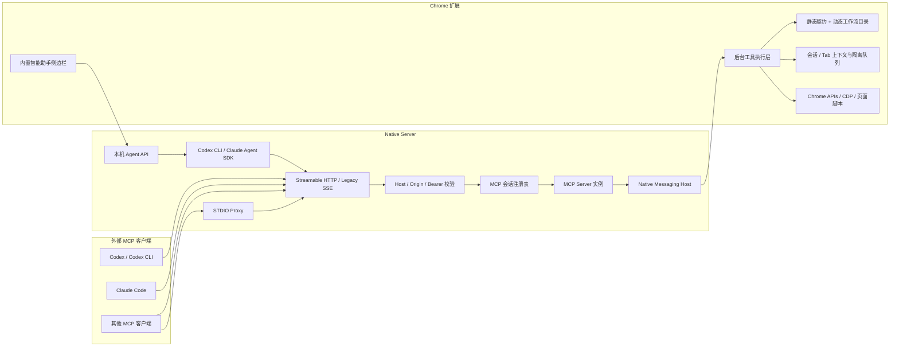

# mcp-chrome-community 架构设计

本文档描述当前社区版的实际运行架构。协议层以 `@modelcontextprotocol/sdk` v1.29 为基线，同时兼容现代客户端和仍只读取文本结果的旧客户端。

## 系统边界

项目由四个运行边界组成：

1. MCP 客户端：Codex、Claude Code、桌面客户端或其他 MCP Agent。
2. Native Server：负责 MCP 传输、会话、安全校验、内置 Agent API 和 Native Messaging。
3. Chrome 扩展：执行浏览器工具、维护动态工作流目录和浏览器会话上下文。
4. 当前 Chrome：复用用户已经打开的窗口、标签页、登录状态和浏览器配置。

## MCP 协议层

### 传输

- 推荐入口：`POST /mcp`，使用 Streamable HTTP。
- 兼容入口：`GET /sse` 与 `/messages`，保留旧 SSE 客户端支持。
- STDIO：`mcp-server-stdio.js` 作为本地代理连接同一个 HTTP MCP 服务，不复制浏览器工具实现。
- 每个 HTTP/SSE 会话创建独立 MCP Server 和 transport，避免跨客户端复用连接状态。

### 工具契约

`packages/shared/src/tools.ts` 是 41 个静态工具的主要事实来源，集中维护：

- `name`、`description` 和严格输入 Schema
- `annotations`，包括只读、破坏性、幂等和开放世界提示
- 中英文检索关键词和别名
- 结果稳定工具的 `outputSchema`

Native Server、扩展执行层、STDIO profile 和测试都消费这套契约，减少定义漂移。

### 结果兼容

稳定的对象结果同时返回：

- `content`：文本或图片内容，兼容旧客户端。
- `structuredContent`：对象结果，供现代 MCP 客户端直接消费。

只有已验证结构稳定的工具声明 `outputSchema`。图片、动态 Flow 和形态不稳定的结果继续以 MCP `content` 为主。

### 工具发现

- `full` profile 直接公布全部 41 个静态工具。
- `core` 与 `search` profile 只公布高频工具和 `chrome_search_tools`、`chrome_describe_tool`、`chrome_call_tool`。
- 动态工作流目录使用每个 MCP Server 实例独立的非阻塞缓存。
- 扩展目录发生真实变化后发送 `notifications/tools/list_changed`。
- 刷新失败时保留最后一次成功缓存，不清空现有目录。

### 取消与进度

MCP 请求的 `AbortSignal` 会贯穿 Native Server、Native Messaging、扩展隔离队列和协作式等待工具。下载等待、网络等待和通用等待支持节流且单调的进度通知；取消时清理监听器、计时器和临时抓包状态。

## Native Server

`app/native-server/` 同时承担三类职责：

- MCP transport 与会话生命周期。
- Native Messaging 到 Chrome 扩展的请求桥接。
- 只允许本机访问的 `/agent/*` 智能助手 API、会话数据库和附件存储。

关键模块：

- `src/server/index.ts`：Fastify、MCP 路由、transport 创建和服务器生命周期。
- `src/server/mcp-session-registry.ts`：会话容量、空闲过期和 transport 清理。
- `src/server/mcp-http-security.ts`：Host、Origin、Bearer token 和远程路由边界。
- `src/mcp/register-tools.ts`：工具注册、动态目录缓存、调用上下文和结果适配。
- `src/native-messaging-host.ts`：扩展连接、请求关联、取消和进度消息。
- `src/agent/`：内置智能助手、SQLite 会话和 Codex/Claude 引擎。

## Chrome 扩展

`app/chrome-extension/` 是浏览器能力的实际执行端：

- 后台工具执行器调用 Chrome APIs、CDP 和内容脚本。
- 浏览器会话上下文按 MCP session/client 隔离最近 tab/window，并对同会话、同 tab 操作排队。
- 内容脚本负责 DOM、页面交互、可视化编辑器和页面侧事件。
- popup 显示连接、MCP 配置和本地语义模型缓存。
- sidepanel 提供内置智能助手界面。

本地语义搜索使用 Transformers.js、Web Worker、IndexedDB 和 WASM SIMD；它与 Codex/Claude 大模型调用是两套独立能力。

## 内置智能助手

内置助手不保存一套独立的第三方 API key：

- Codex 引擎启动本机 `codex` CLI，沿用 `~/.codex` 的登录、provider 和默认模型配置。
- Claude 引擎通过 `@anthropic-ai/claude-agent-sdk`，沿用本机 Claude Code 登录或相关环境变量。
- 模型留空时由本机 CLI/SDK 选择当前默认模型。
- Codex 模型目录通过 `codex debug models` 运行时发现；Claude 使用 `fable`、`opus`、`sonnet`、`haiku` 最新别名。
- 用户仍可在项目或会话设置里填写任意模型 ID，不受扩展内置列表限制。

两个引擎都会把本项目的 Streamable HTTP MCP 地址按当前 token 配置注入本次运行，不修改用户的全局 MCP 配置。

## 安全边界

- 默认绑定回环地址，未配置 token 时只适合本机使用。
- 非回环监听必须配置 `CHROME_MCP_AUTH_TOKEN`；通配监听还必须配置 `CHROME_MCP_ALLOWED_HOSTS`。
- MCP 路由执行严格 Host/Origin 校验，并限制会话数量和空闲时间。
- `/agent/*` 和扩展内部 HTTP API 即使服务器开放远程 MCP，也仍要求本机来源。
- Claude 的 `bypassPermissions` 和 Codex 的 `danger-full-access` 都需要显式配置；默认权限不会自动绕过。

## 验证边界

- `pnpm run typecheck`：Shared、Native Server 和 Extension 类型基线。
- `pnpm --filter mcp-chrome-community-bridge test`：协议、会话、安全和 Agent 策略单测。
- `pnpm smoke:stdio`：STDIO 工具目录和协议兼容。
- `pnpm smoke:stdio -- --call-health`：连接真实扩展并检查版本与 Schema。
- `pnpm smoke:stdio -- --real-browser --verbose`：在本地 fixture 中验证可逆的真实浏览器流程。

新增工具时应先修改共享契约，再实现扩展执行器，并同步单元测试、真实浏览器测试和 `docs/TOOLS*.md`。
